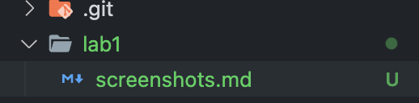
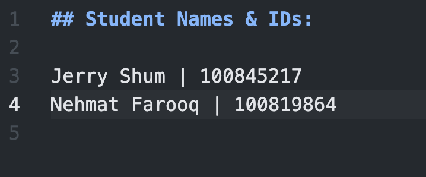
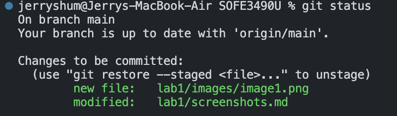
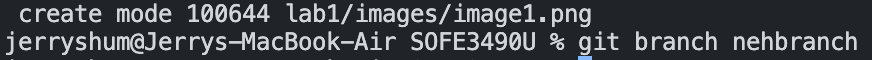
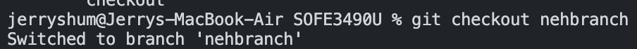
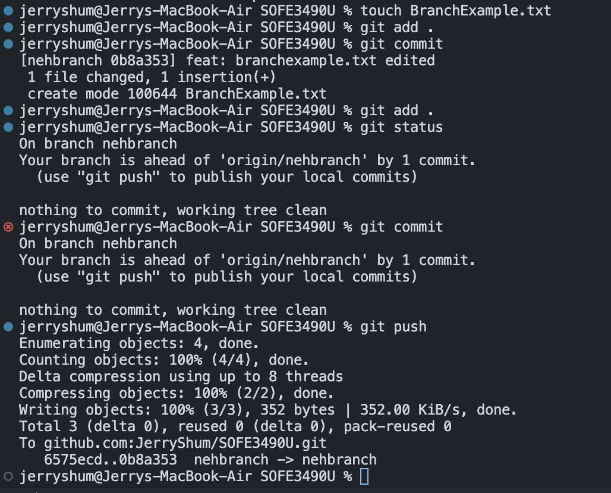

# Screenshots:

- Created screenshots document

  

- Students.md creation

  

- git status

  

- create branch "nehbranch"

  

- switching to nehbranch

  

- BranchExample.txt process

  

- RemoveExample.txt example

  
